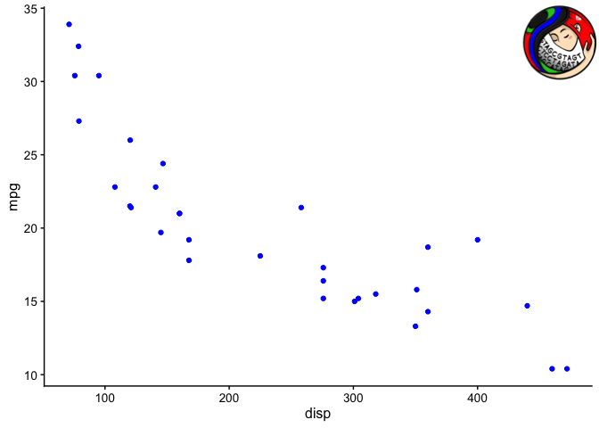
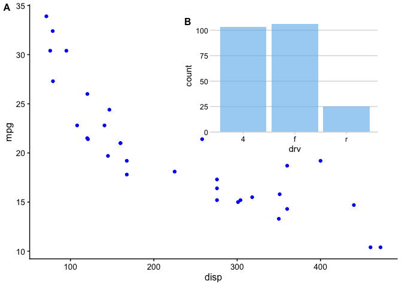
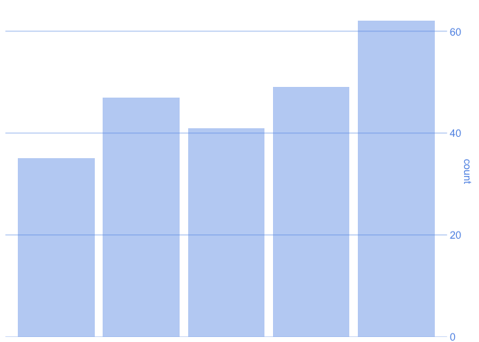
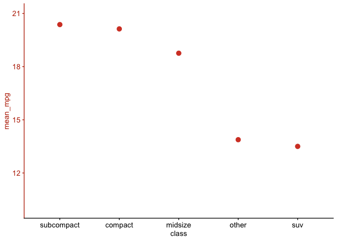
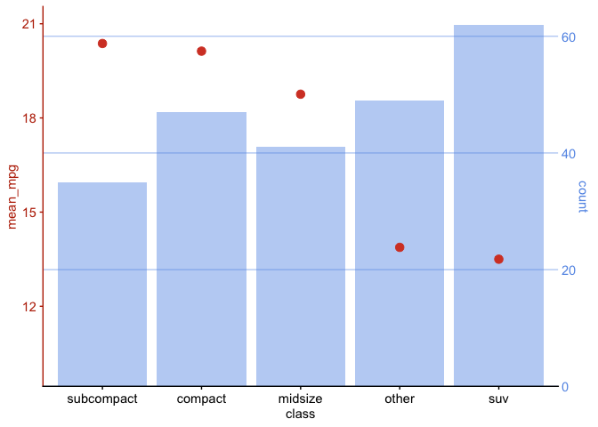
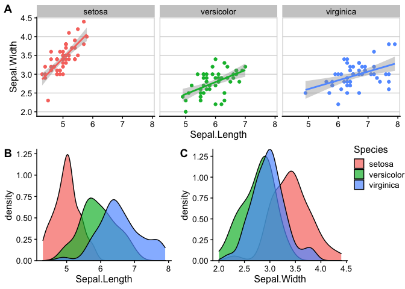

<!-- README.md is generated from README.Rmd. Please edit that file -->

``` r
library(cowplot)
```

    ## 
    ## ********************************************************

    ## Note: As of version 1.0.0, cowplot does not change the

    ##   default ggplot2 theme anymore. To recover the previous

    ##   behavior, execute:
    ##   theme_set(theme_cowplot())

    ## ********************************************************

``` r
library(here)
```

    ## here() starts at /Users/kelly/projects/schloss-lab/plot-recreation

``` r
library(magick)
```

    ## Linking to ImageMagick 6.9.9.39
    ## Enabled features: cairo, fontconfig, freetype, lcms, pango, rsvg, webp
    ## Disabled features: fftw, ghostscript, x11

``` r
library(tidyverse)
```

    ## ── Attaching packages ─────────────────────────────────────────────────────────────── tidyverse 1.3.0 ──

    ## ✓ ggplot2 3.3.0.9000     ✓ purrr   0.3.3     
    ## ✓ tibble  3.0.0          ✓ dplyr   0.8.5     
    ## ✓ tidyr   1.0.2          ✓ stringr 1.4.0     
    ## ✓ readr   1.3.1          ✓ forcats 0.5.0

    ## ── Conflicts ────────────────────────────────────────────────────────────────── tidyverse_conflicts() ──
    ## x dplyr::filter() masks stats::filter()
    ## x dplyr::lag()    masks stats::lag()

# plot-recreation

<!-- badges: start -->

<!-- badges: end -->

Re-creating plots to learn cool tricks and practice problem-solving.

## Exercises

View the plots below and try to write the code that creates them\! There
are more exercises here than you can probably get to in the time
allotted. Just pick ones to work on based on how interested you are in
learning how to create it. At the end, we’ll each share one solution.

As much as this is an exercise in data viz with R, it’s also an exercise
in finding solutions in package documentation and general
problem-solving. If you get stuck, take a look at the [hints](hints.md)
or send Kelly a message in Slack.

### Formatting text

#### Italics

#### Color

### Plot on an image

### Image on a plot

``` r
p <- ggplot(mtcars, aes(disp, mpg)) + 
  geom_point(size = 1.5, color = "blue") +
  theme_cowplot(12)

# from https://github.com/mothur/logo
logo_file <- here("figures","mothur_RGB.png")

ggdraw() + 
  draw_plot(p) +
  draw_image(logo_file, x = 1, y = 1, hjust = 1, vjust = 1, width = 0.13, height = 0.2)
```

<!-- -->

### Plots in a grid

### One title for two plots

### Inset plots

``` r
inset <- ggplot(mpg, aes(drv)) + 
  geom_bar(fill = "skyblue2", alpha = 0.7) + 
  scale_y_continuous(expand = expand_scale(mult = c(0, 0.05))) +
  theme_minimal_hgrid(11)
```

    ## Warning: `expand_scale()` is deprecated; use `expansion()` instead.

``` r
ggdraw(p + theme_half_open(12)) +
  draw_plot(inset, .45, .45, .5, .5) +
  draw_plot_label(
    c("A", "B"),
    c(0, 0.45),
    c(1, 0.95),
    size = 12
  )
```

<!-- -->

### Overlaying plots

``` r
city_mpg <- mpg %>%
  mutate(class = fct_lump(class, 4, other_level = "other")) %>%
  group_by(class) %>%
  summarize(
    mean_mpg = mean(cty),
    count = n()
  ) %>% 
  mutate(class = fct_reorder(class, -mean_mpg))
```

    ## Warning in rank(-calcs$count, ties = ties.method): partial argument match of
    ## 'ties' to 'ties.method'

``` r
p1 <- ggplot(city_mpg, aes(class, count)) +
  geom_col(fill = "#6297E770") + 
  scale_y_continuous(
    expand = expand_scale(mult = c(0, 0.05)),
    position = "right"
  ) +
  theme_minimal_hgrid(11, rel_small = 1) +
  theme(
    panel.grid.major = element_line(color = "#6297E770"),
    axis.line.x = element_blank(),
    axis.text.x = element_blank(),
    axis.title.x = element_blank(),
    axis.ticks = element_blank(),
    axis.ticks.length = grid::unit(0, "pt"),
    axis.text.y = element_text(color = "#6297E7"),
    axis.title.y = element_text(color = "#6297E7")
  )
```

    ## Warning: `expand_scale()` is deprecated; use `expansion()` instead.

``` r
p1
```

<!-- -->

``` r
p2 <- ggplot(city_mpg, aes(class, mean_mpg)) + 
  geom_point(size = 3, color = "#D5442D") + 
  scale_y_continuous(limits = c(10, 21)) +
  theme_half_open(11, rel_small = 1) +
  theme(
    axis.ticks.y = element_line(color = "#BB2D05"),
    axis.text.y = element_text(color = "#BB2D05"),
    axis.title.y = element_text(color = "#BB2D05"),
    axis.line.y = element_line(color = "#BB2D05")
  )
p2
```

<!-- -->

``` r
aligned_plots <- align_plots(p1, p2, align="hv", axis="tblr")
overlaid_plots <- ggdraw(aligned_plots[[1]]) + draw_plot(aligned_plots[[2]])
overlaid_plots
```

<!-- -->

### Multi-panel figure

``` r
# plot 1
p1 <- ggplot(iris, aes(Sepal.Length, Sepal.Width, color = Species)) + 
  geom_point() + 
  stat_smooth(method = "lm") +
  facet_grid(. ~ Species) +
  theme_half_open(12) +
  background_grid(major = 'y', minor = "none") + 
  panel_border() + 
  theme(legend.position = "none")

# plot 2
p2 <- ggplot(iris, aes(Sepal.Length, fill = Species)) +
  geom_density(alpha = .7) + 
  scale_y_continuous(expand = expand_scale(mult = c(0, 0.05))) +
  theme_half_open(12) +
  theme(legend.justification = "top")
```

    ## Warning: `expand_scale()` is deprecated; use `expansion()` instead.

``` r
p2a <- p2 + theme(legend.position = "none")

# plot 3
p3 <- ggplot(iris, aes(Sepal.Width, fill = Species)) +
  geom_density(alpha = .7) + 
  scale_y_continuous(expand = c(0, 0)) +
  theme_half_open(12) +
  theme(legend.position = "none")

# legend
legend <- get_legend(p2)

# align all plots vertically
plots <- align_plots(p1, p2a, p3, align = 'v', axis = 'l')
```

    ## `geom_smooth()` using formula 'y ~ x'

``` r
# put together the bottom row and then everything
bottom_row <- plot_grid(
  plots[[2]], plots[[3]], legend,
  labels = c("B", "C"),
  rel_widths = c(1, 1, .3),
  nrow = 1
)
plot_grid(plots[[1]], bottom_row, labels = c("A"), ncol = 1)
```

<!-- -->

## Solutions

See the \[key\] branch for the solutions.
