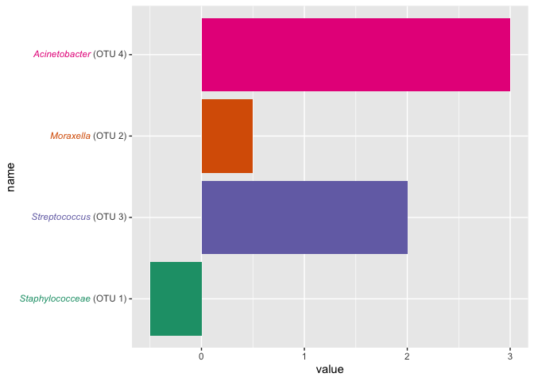
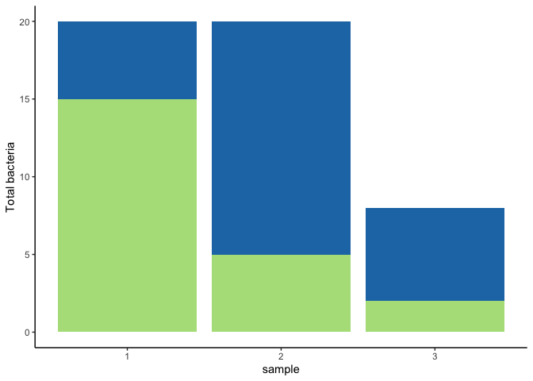

<!-- README.md is generated from README.Rmd. Please edit that file -->

# plot-recreation

<!-- badges: start -->

<!-- badges: end -->

Re-creating plots to learn cool tricks and practice problem-solving.

``` r
library(cowplot)
library(glue)
library(ggtext)
library(gridtext)
library(here)
library(magick)
library(RColorBrewer)
library(tidyverse)
```

## Exercises

View the plots below and try to write the code that creates them\! There
are more exercises here than you can probably get to in the time
allotted. Feel free to jump around and pick ones to work on based on how
interested you are in learning how to create the plot. At the end, we’ll
each share one solution.

As much as this is an exercise in data viz with R, it’s also an exercise
in finding solutions in package documentation and general
problem-solving. Google is your friend\! If you get stuck, take a look
at the [hints](hints.md) or send Kelly a message in Slack.

  - [Exercises](#exercises)
      - [Italicize text](#italicize-text)
      - [Color axis text](#color-axis-text)
      - [Color & bold axis label](#color-bold-axis-label)
      - [Assign colors manually](#assign-colors-manually)
      - [Image on a plot](#image-on-a-plot)
      - [Plot on an image](#plot-on-an-image)
      - [Plots in a grid](#plots-in-a-grid)
      - [One title for two plots](#one-title-for-two-plots)
      - [Inset plots](#inset-plots)
      - [Overlaying plots](#overlaying-plots)
      - [Multi-panel figure](#multi-panel-figure)
  - [Solutions](#solutions)

### Italicize text


Source: [Claus Wilke’s talk at
rstudio::conf(2020)](https://twitter.com/ClausWilke/status/1222944728443809792)

``` r
otu_data <- tribble(~otu, ~bact, ~value,
                       1, 'Staphylococceae', -0.5,
                       2, 'Moraxella', 0.5,
                       3, 'Streptococcus', 2,
                       4, 'Acinetobacter', 3.0
                    ) %>% mutate(name = glue("*{bact}* (OTU {otu})"))
otu_data %>% 
    ggplot(aes(XXXXXX, XXXXXX)) +
    geom_XXXXXX() + 
    XXXXXX() +
    theme(axis.text.y = XXXXXX)
```

    ## Error in geom_XXXXXX(): could not find function "geom_XXXXXX"

### Color axis text



Source: [Claus Wilke’s talk at
rstudio::conf(2020)](https://twitter.com/ClausWilke/status/1222944728443809792)

``` r
# make some fake data
otu_data <- otu_data %>% 
    mutate(color = brewer.pal(4, "Dark2"),
           name = glue("<i style='color:{color}'>{bact}</i> (OTU {otu})"))
# plot it
otu_data %>% 
    ggplot(aes(XXXXXX, XXXXXX)) +
    XXXXXX() + 
    XXXXXX() +
    theme(axis.text.y = XXXXXX)
```

    ## Error in XXXXXX(): could not find function "XXXXXX"

### Color & bold axis label


Inspiration: fig. 2C from Jay’s recent journal club paper: [Zhai et
al 2018 Nature
Med](https://www.nature.com/articles/s41591-019-0709-7/figures/2)

``` r
# make some fake data
time_data <-tibble(time = seq(0,5,0.1),
               yes = sin(time * 0.8) + 0.8,
               no = sin(time * -0.5) + 1
                ) %>% pivot_longer(-time, names_to = "infected", values_to = "value")
head(time_data)
```

    ## # A tibble: 6 x 3
    ##    time infected value
    ##   <dbl> <chr>    <dbl>
    ## 1   0   yes      0.8  
    ## 2   0   no       1    
    ## 3   0.1 yes      0.880
    ## 4   0.1 no       0.950
    ## 5   0.2 yes      0.959
    ## 6   0.2 no       0.900

``` r
# plot it
time_data %>% ggplot(aes(x = XXXXXX, y = XXXXXX, color = infected)) +
    geom_XXXXXX() +
    ylab("<b style='color:#00BFC4'>Candidemia</b> vs. <b style='color:#F8766D'>no Candidemia</b> ITS1 diversity") +
    theme_XXXXXX() +
    theme(legend.position = XXXXXX,
          axis.title.y = XXXXXX)
```

    ## Error in geom_XXXXXX(): could not find function "geom_XXXXXX"

### Assign colors manually



Adapted from:
<https://github.com/SchlossLab/compositional_data_analysis>

``` r
otu_table <- tibble(
    sample = c("1", "2", "3", "1", "2", "3"),
    otu = c("A", "A", "A", "B", "B", "B"),
    abun = c(5, 15, 6, 15, 5, 2)
)
palette = brewer.pal(n = 4, name = "Paired")
colors = c(
  A = palette[[2]],
  B = palette[[3]]
)

# plot total counts (aboslute abundace)
otu_table %>%
    ggplot(aes(x = sample, y = XXXXXX, fill = XXXXXX)) +
    geom_XXXXXX() +
    scale_XXXXXX_manual("otu", values=colors) +
    XXXXXX("Total bacteria") +
    theme_classic()
```

    ## Error in geom_XXXXXX(): could not find function "geom_XXXXXX"

### Image on a plot


Adapted from:
<https://github.com/SchlossLab/compositional_data_analysis>

``` r
otu_table <- tibble(
    sample = c("1", "2", "3", "1", "2", "3"),
    otu = c("A", "A", "A", "B", "B", "B"),
    abun = c(5, 15, 6, 15, 5, 2)
)
# from https://github.com/mothur/logo
logo_file <- here("figures", "mothur_RGB.png")

# plot total counts (aboslute abundace)
plot_total <-  otu_table %>%
    ggplot(aes(x = XXXXXX, y = XXXXXX, fill = XXXXXX)) +
    geom_XXXXXX() +
    XXXXXX("Total bacteria") +
    theme_classic()
```

    ## Error in geom_XXXXXX(): could not find function "geom_XXXXXX"

``` r
ggXXXX() + 
  draw_XXXXXX(plot_total) +
  draw_XXXXXX(logo_file, x = 1, y = 1, 
             hjust = 1.2, vjust = 1.2, 
             width = 0.3, height = 0.3)
```

    ## Error in ggXXXX(): could not find function "ggXXXX"

### Plot on an image

*With great power, comes great responsibility. Use at your own risk\!*


Adapted from:
<https://wilkelab.org/cowplot/articles/drawing_with_on_plots.html#combining-plots-and-images>

``` r
rides <- read_csv('https://raw.githubusercontent.com/kelly-sovacool/strava/master/data/processed/activities.csv', col_types = cols()) %>% 
    filter(distance_mi > 1, as.character(type) == 'Ride', year >= 2019) %>% 
    select(distance_mi, start_date)

# source https://www.pinclipart.com/picdir/big/196-1969309_free-bicycle-bike-cartoon-no-background-clipart.png
bike_img <- here('figures', 'bike.png') %>%
    image_read() %>% 
    image_colorize(70, "white")

# make the plot
rides_plot <- rides %>%
  ggplot(aes(XXXXXX, XXXXXX)) +
  geom_point(color='blue', alpha=0.8, size=2) +
    theme_XXXXXX()
```

    ## Error in theme_XXXXXX(): could not find function "theme_XXXXXX"

``` r
XXXXXX() + 
  draw_XXXXXX(bike_img) + 
  draw_XXXXXX(rides_plot)
```

    ## Error in XXXXXX(): could not find function "XXXXXX"

### Plots in a grid


Source:
<https://github.com/SchlossLab/OptiFitAnalysis/tree/master/exploratory/2020#performance-as-measured-by-runtime>

``` r
benchmarks_fit <-read_tsv('https://raw.githubusercontent.com/SchlossLab/OptiFitAnalysis/master/subworkflows/2_fit_reference_db/results/benchmarks.tsv?token=AEHR6TPPUNNM245DZ7TUP2C7ADK5E', col_types = cols())
benchmarks_clust <- read_tsv('https://raw.githubusercontent.com/SchlossLab/OptiFitAnalysis/master/subworkflows/1_prep_samples/results/benchmarks.tsv?token=AEHR6TNCIGRVN3B5GEVRVNC7ADLAS', col_types = cols())

plot_box_time <- function(df) {
  df %>%
    group_by(dataset, method) %>%
    ggplot(aes(x = method, y = s, color = dataset)) +
    geom_XXXXXX() +
    scale_XXXXXX_XXXXXX() +
    facet_XXXXXX("ref") +
    ylim(0,2100) +
    labs(y = 'seconds') +
    theme_XXXXXX() +
    XXXXXX(axis.title.x = element_blank())
}

time_plot_fit <- benchmarks_fit %>% 
  plot_box_time() +
  XXXXXX(axis.text.y = XXXXXX(),
        axis.title.y = XXXXXX())
```

    ## Error in geom_XXXXXX(): could not find function "geom_XXXXXX"

``` r
time_plot_clust <- benchmarks_clust %>% 
  plot_box_time() +
  theme(legend.position = XXXXXX)
```

    ## Error in geom_XXXXXX(): could not find function "geom_XXXXXX"

``` r
plot_XXXXXX(time_plot_clust, time_plot_fit, XXXXXX = "h", rel_widths = c(1,3))
```

    ## Error in plot_XXXXXX(time_plot_clust, time_plot_fit, XXXXXX = "h", rel_widths = c(1, : could not find function "plot_XXXXXX"

### One title for two plots


Adapted from:
<https://wilkelab.org/cowplot/articles/plot_grid.html#joint-plot-titles>

``` r
mph_per_kph <- 0.621371
rides <- read_csv('https://raw.githubusercontent.com/kelly-sovacool/strava/master/data/processed/activities.csv', col_types = cols()) %>% 
    filter(distance_mi > 1, as.character(type) == 'Ride') %>% 
    mutate(average_speed_mph = average_speed * mph_per_kph) %>% 
    select(distance_mi, average_speed_mph, moving_time_hrs, start_date)

# make a plot grid consisting of two panels
p1 <- ggplot(rides, aes(x = XXXXXX, y = distance_mi)) + 
  geom_XXXXXX(colour = "blue") + 
  theme_XXXXXX(12) + 
  XXXXXX_grid(minor = 'none')
```

    ## Error in geom_XXXXXX(colour = "blue"): could not find function "geom_XXXXXX"

``` r
p2 <- ggplot(rides, aes(x = moving_time_hrs, y = XXXXXX)) + 
  geom_XXXXXX(colour = "green") + 
  theme_XXXXXX(12) + 
  background_XXXXXX(minor = 'none') +
    theme(axis.title.y = element_XXXXXX())
```

    ## Error in geom_XXXXXX(colour = "green"): could not find function "geom_XXXXXX"

``` r
plot_row <- plot_XXXXXX(p1, p2)
```

    ## Error in plot_XXXXXX(p1, p2): could not find function "plot_XXXXXX"

``` r
# now add the title
title <- ggXXXX() + 
  draw_XXXXXX(
    "Distance travelled with average speed and time spent moving",
    fontface = 'bold',
    x = 0,
    hjust = 0
  ) +
  XXXXXX(
    # add margin on the left of the drawing canvas,
    # so title is aligned with left edge of first plot
    plot.margin = margin(0, 0, 0, 7)
  )
```

    ## Error in ggXXXX(): could not find function "ggXXXX"

``` r
plot_XXXXXX(XXXXXX, plot_row, ncol = XXXXXX,
  # rel_heights values control vertical title margins
  rel_heights = c(0.1, 1)
)
```

    ## Error in plot_XXXXXX(XXXXXX, plot_row, ncol = XXXXXX, rel_heights = c(0.1, : could not find function "plot_XXXXXX"

### Inset plots


Adapted from:
<https://wilkelab.org/cowplot/articles/drawing_with_on_plots.html#making-inset-plots>

``` r
rides <- read_csv('https://raw.githubusercontent.com/kelly-sovacool/strava/master/data/processed/activities.csv', col_types = cols()) %>% 
    filter(distance_mi > 1, as.character(type) == 'Ride') %>% 
    select(distance_mi, start_date, year)

plot_point <- rides %>% ggplot(aes(start_date, XXXXXX)) +
  XXXXXX(color='red') +
  theme_minimal_grid(12)
```

    ## Error in XXXXXX(color = "red"): could not find function "XXXXXX"

``` r
inset <- rides %>%  
    group_by(year) %>% 
    summarize(sum_distance_mi=sum(distance_mi)) %>% 
    ggplot(aes(XXXXXX, sum_distance_mi)) + 
  geom_bar(stat = "Identity", XXXXXX = "skyblue2", alpha = 0.7) + 
    labs(y='Total Distance (mi)') +
  XXXXXX_XXXXXX_continuous(expand = expansion(mult = c(0, 0.05))) +
  theme_XXXXXX_hgrid(11)
```

    ## Warning: Ignoring unknown parameters: XXXXXX

    ## Error in XXXXXX_XXXXXX_continuous(expand = expansion(mult = c(0, 0.05))): could not find function "XXXXXX_XXXXXX_continuous"

``` r
ggdraw(plot_point + theme_XXXXXX_open(12)) +
  draw_XXXXXX(inset, x = 0.1, y = .45, width = .5, height = .5) +
  draw_XXXXXX_XXXXXX(
    c("A", "B"),
    c(0, 0.1),
    c(1, 0.95),
    size = 12
  )
```

    ## Error in ggdraw(plot_point + theme_XXXXXX_open(12)): object 'plot_point' not found

### Overlaying plots


Source: <https://wilkelab.org/cowplot/articles/aligning_plots.html>

``` r
# make up some non-sensical data
alpha_data <- tibble(sample = as.factor(1:10),
                     otu_count = runif(10, min = 0, max = 100),
                     alpha_div = rnorm(10, mean = 2, sd = 0.5)
                     )

plot_col <- alpha_data %>%
    ggplot(aes(sample, otu_count)) +
    XXXXXX_col(fill = "#6297E770") +
    XXXXXX_XXXXXX_continuous(expand = expansion(mult = c(0, 0.05)),
                             position = "right") +
    scale_x_discrete() +
    XXXXXX_minimal_hgrid(11, rel_small = 1) +
    XXXXXX(
        panel.grid.major = element_XXXXXX(color = "#6297E770"),
        axis.line.x = element_XXXXXX(),
        axis.text.x = element_XXXXXX(),
        axis.title.x = element_XXXXXX(),
        axis.ticks = element_XXXXXX(),
        axis.ticks.length = grid::unit(0, "pt"),
        axis.text.y = element_XXXXXX(color = "#6297E7"),
        axis.title.y = element_XXXXXX(color = "#6297E7")
    )
```

    ## Error in XXXXXX_col(fill = "#6297E770"): could not find function "XXXXXX_col"

``` r
plot_point <- alpha_data %>% 
    ggplot(aes(sample, alpha_div)) + 
  XXXXXX_XXXXXX(size = 3, color = "#D5442D") + 
  XXXXXX_XXXXXX_continuous(limits = c(0, 4.5)) +
  theme_half_open(11, rel_small = 1) +
    scale_XXXXXX_discrete() +
  theme(
    axis.ticks.y = element_XXXXXX(color = "#BB2D05"),
    axis.text.y = element_XXXXXX(color = "#BB2D05"),
    axis.title.y = element_XXXXXX(color = "#BB2D05"),
    axis.line.y = element_XXXXXX(color = "#BB2D05")
  )
```

    ## Error in XXXXXX_XXXXXX(size = 3, color = "#D5442D"): could not find function "XXXXXX_XXXXXX"

``` r
aligned_plots <- XXXXXX_plots(plot_col, plot_point, align="hv", axis="tblr")
```

    ## Error in XXXXXX_plots(plot_col, plot_point, align = "hv", axis = "tblr"): could not find function "XXXXXX_plots"

``` r
overlaid_plots <- XXXXXX(aligned_plots[[1]]) + 
    XXXXXX_plot(aligned_plots[[2]])
```

    ## Error in XXXXXX(aligned_plots[[1]]): could not find function "XXXXXX"

``` r
overlaid_plots
```

    ## Error in eval(expr, envir, enclos): object 'overlaid_plots' not found

### Multi-panel figure


Source: <https://wilkelab.org/cowplot/articles/shared_legends.html>

``` r
# plot 1
p1 <- ggplot(iris, aes(Sepal.Length, Sepal.Width, color = Species)) + 
  geom_XXXXXX() + 
  stat_smooth(method = "lm") +
  facet_XXXXXX(. ~ Species) +
  theme_half_open(12) +
  background_grid(major = 'y', minor = "none") + 
  panel_border() + 
  XXXXXX(legend.position = "none")
```

    ## Error in geom_XXXXXX(): could not find function "geom_XXXXXX"

``` r
# plot 2
p2 <- ggplot(iris, aes(Sepal.Length, fill = Species)) +
  XXXXXX_density(alpha = .7) + 
  scale_XXXXXX_XXXXXX(expand = expansion(mult = c(0, 0.05))) +
  theme_XXXXXX_open(12) +
  XXXXXX(legend.justification = "top")
```

    ## Error in XXXXXX_density(alpha = 0.7): could not find function "XXXXXX_density"

``` r
p2a <- p2 + XXXXXX(legend.position = "none")
```

    ## Error in eval(expr, envir, enclos): object 'p2' not found

``` r
# plot 3
p3 <- ggplot(iris, aes(Sepal.Width, fill = Species)) +
  geom_density(alpha = .7) + 
  XXXXXX_XXXXXX_continuous(expand = c(0, 0)) +
  theme_half_XXXXXX(12) +
  XXXXXX(legend.position = "none")
```

    ## Error in XXXXXX_XXXXXX_continuous(expand = c(0, 0)): could not find function "XXXXXX_XXXXXX_continuous"

``` r
legend <- XXXXXX_XXXXXX(p2)
```

    ## Error in XXXXXX_XXXXXX(p2): could not find function "XXXXXX_XXXXXX"

``` r
# align all plots vertically
plots <- XXXXXX_XXXXXX(p1, p2a, p3, align = 'v', axis = 'l')
```

    ## Error in XXXXXX_XXXXXX(p1, p2a, p3, align = "v", axis = "l"): could not find function "XXXXXX_XXXXXX"

``` r
# put together the bottom row and then everything
bottom_row <- plot_XXXXXX(
  plots[[2]], plots[[3]], legend,
  labels = c("B", "C"),
  rel_widths = c(1, 1, .3),
  nrow = 1
)
```

    ## Error in plot_XXXXXX(plots[[2]], plots[[3]], legend, labels = c("B", "C"), : could not find function "plot_XXXXXX"

``` r
plot_XXXXXX(plots[[1]], bottom_row, labels = c("A"), ncol = 1)
```

    ## Error in plot_XXXXXX(plots[[1]], bottom_row, labels = c("A"), ncol = 1): could not find function "plot_XXXXXX"

## Solutions

A link to the source or inspiration is given under each code chunk. See
the [key](https://github.com/SchlossLab/plot-recreation/tree/key) branch
for the exact solutions.

Many of these are taken directly from another source, in some cases with
slight modifications. The original creators’ copyrights still apply; all
are OSI-approved licenses.
